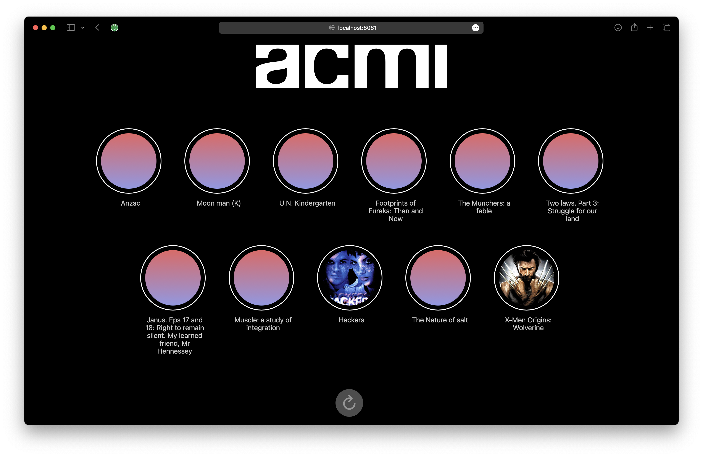
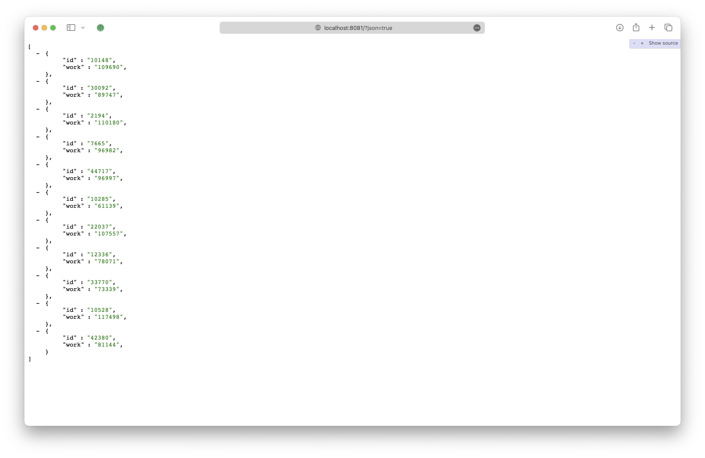

# ACMI Works embeddings

A recommendation engine for Works in the ACMI Collection using [OpenAI embeddings](https://platform.openai.com/docs/guides/embeddings/what-are-embeddings).




## Use

* Connect to your ACMI VPN to access XOS private APIs (or point to your own API)
* Copy the `config.tmpl.env` file to `config.env`
* Set `DEFAULT_TEMPLATE_JSON=false` if you'd like to see HTML results rather than JSON results
* Start your environment: `make up`
* Click a work to get its nearest neighbours: http://localhost:8081/?json=false

### Rebuild the Chroma database from your Embeddings API

* Open `config.env` and set `REBUILD=true`
* Delete the `works_db` directory if it exists
* Start the app: `make up`

## Create Embeddings

This prototype relies on having already created OpenAI Embeddings for your collection database.

Code we use to create Embeddings:

```python
def create_embeddings(self, work):
    """
    Create an Embedding from a Work.
    """
    embedding = None
    work_features = [
        work.get_title_display(),
        work.description_override or work.description,
        work.work_type,
        work.creator_credit(),
        work.headline_credit(),
    ]
    work_features = list(filter(None, work_features))
    text_string = '\n'.join(work_features)
    embeddings_json = self.get_embeddings(text_string)
    if embeddings_json:
        embedding, _ = Embedding.objects.get_or_create(
            work=work,
            defaults={'data': embeddings_json},
        )
        embedding.data = embeddings_json
        embedding.save()
    return embedding
```

An example of the resulting `JSON` Embedding model from the XOS `/embeddings/` API endpoint:

```json
{
  "id": 6826,
  "data": {
    "data": [
      {
        "index": 0,
        "object": "embedding",
        "embedding": [
          0.010930221527814865, -0.01788223721086979, 0.009138058871030807,
          -0.0015344980638474226, 0.00028023053891956806, 0.015440168790519238,
          ...
        ]
      }
    ],
    "model": "text-embedding-ada-002-v2",
    "usage": { "total_tokens": 101, "prompt_tokens": 101 },
    "object": "list"
  },
  "work": 108230
}
```

## TODO

- [x] Submodule Chroma vector database
- [x] Build Flask interface for prototyping
- [x] Load Chroma with XOS Works embeddings
- [x] Get recommendations based on an ACMI collection Work
- [x] Remove Chroma submodule if not necessary
- [x] Fix CORS issue loading images locally
